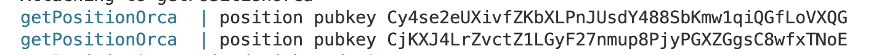

# get-position-orca-ms

To run this code fill your wallet.json, make sure you have docker running, then run docker compose up --build

If it works this supposed to show you the position addresses:

